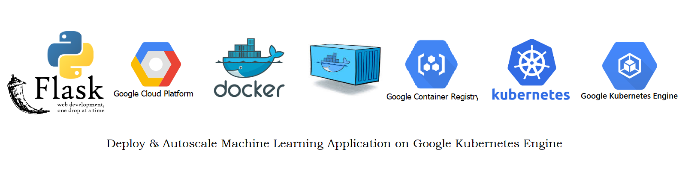

# Deploy and Autoscale Machine Learning Model on Google Kubernetes Engine 

Kubernetes is a container orchestration system that automates deployment, scaling, 
and management of containerized applications. In other words, it helps us handle multiple containers 
with the same or different applications

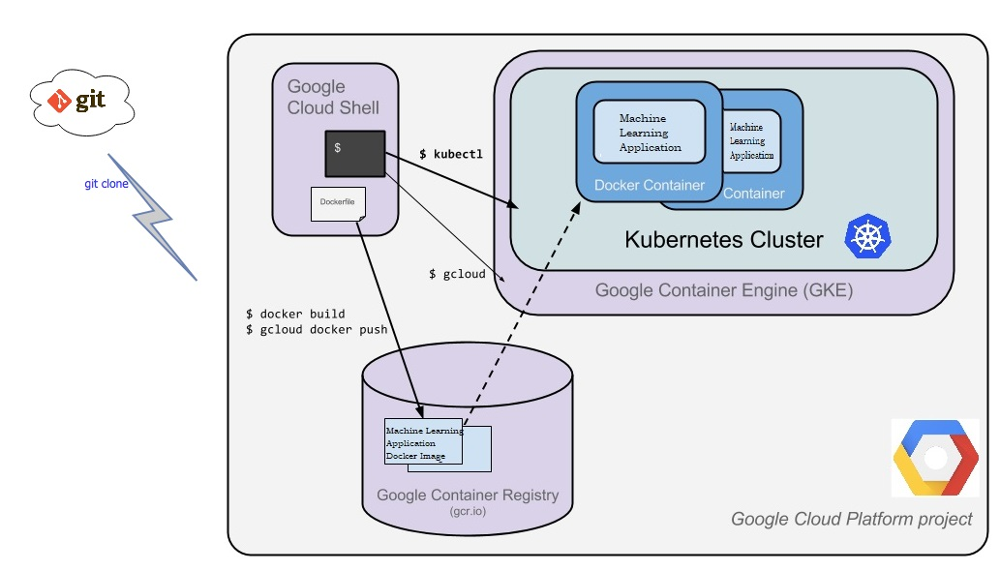

Kubernetes comes with some very important features that we use in our everyday ML DevOps life:

### Scheduling: 

Decides where and when containers should run

### Lifecycle and health: 

Ensures that all containers are up all time and it spins up new ones when an old container dies

### Scaling: 

Provides an easy way to scale containers up or down, manually or automatically (autoscaling)

### Load balancing:

Automatically distributes the load between containers

## Steps for deploying ML model

1. Create a new project in GCP

2. Enable Container Registry and Kubernetes Engine

3. Activate Cloud Shell

4. Import Project 

5. Set Project ID Environment Variable

6. Build the docker image

7. Upload docker image on Google Container Registry

8. Create Cluster

9. Deploy Application

10.Expose your application to the internet

11.Check Service

12.See the app in action on http://EXTERNAL-IP:PORT

13.Configuring autoscale deployment in kubernetes   

## Step 1 - Create a new project in GCP Console

Sign-in GCP console and go to Manage Resources, Click on create New Project

## Step 2 - Enable Container Registry and Kubernetes Engine

Enable Container Registry and Kubernetes Engine in Google Cloud Platform

## Step 3 - Activate Cloud Shell

Click the Activate Cloud Shell button at the top of the console window to open the Cloud Shell

## Step 4 - Import Project 

Clone the GitHub repository in Cloud Shell 

           git clone <GitHub_repository_web_URL>

## Step 5 - Set Project ID Environment Variable

Execute the following code in Cloud Shell to set the PROJECT_ID environment variable:

           export PROJECT_ID= <project_name>

## Step 6 - Build the docker image

Create the docker image of the application by executing the following code:

            docker build -t gcr.io/${PROJECT_ID}/insurance-app:v1 

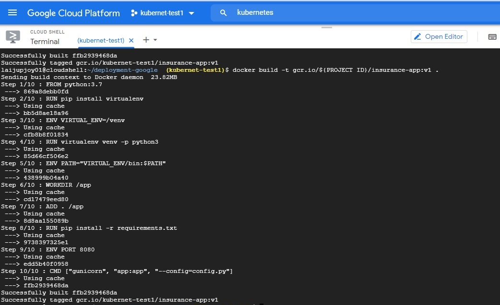

## Step 7 - Upload docker image on Google Container Registry
   
    i. Authenticate to Container Registry (you need to run this only once):
       
       gcloud auth configure-docker
    
   ii. Execute the following code to upload the docker image to Google Container Registry:
         
       docker push gcr.io/${PROJECT_ID}/insurance-app:v1

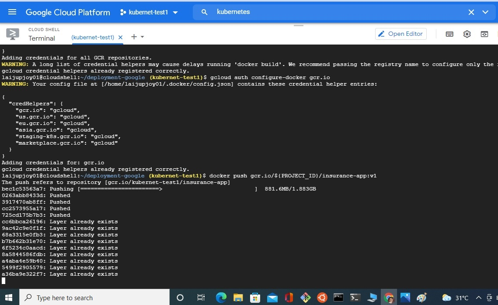

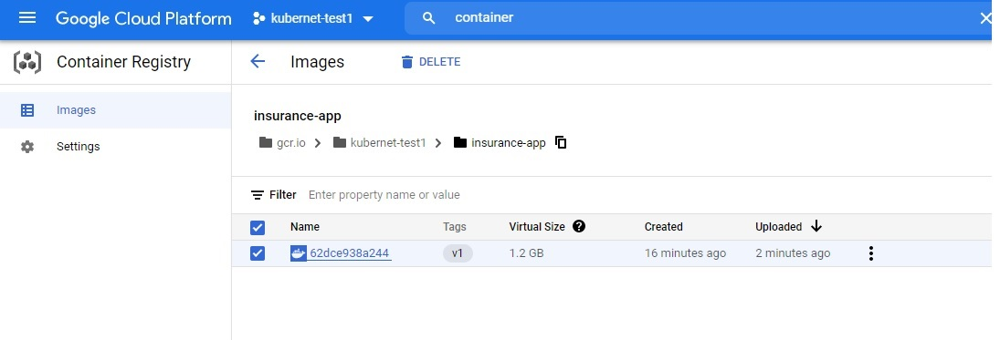
 
## Step 8 - Create Cluster

Container is uploaded, then we need a cluster to run the container.
A Kubernetes cluster is a set of nodes that run containerized applications.
Kubernetes clusters allow containers to run across multiple machines and environments: 
virtual, physical, cloud-based, and on-premises.

     i. Set your project ID and Compute Engine zone options for the gcloud tool:

        gcloud config set project $PROJECT_ID 
        gcloud config set compute/zone us-central1
     
    ii. Create a cluster by executing the following code:
    
        gcloud container clusters create insurance-cluster --num-nodes=1

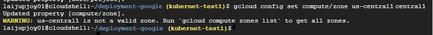

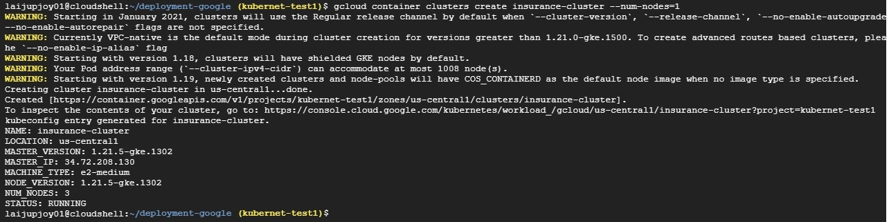

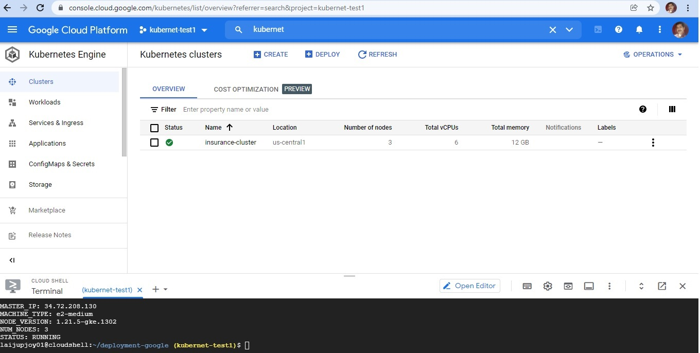

## Step 9 - Deploy Application

To deploy and manage applications on a GKE cluster, you must communicate with the Kubernetes cluster management system. 
Execute the following command to deploy the application:

kubectl create deployment insurance-app --image=gcr.io/${PROJECT_ID}/insurance-app:v1

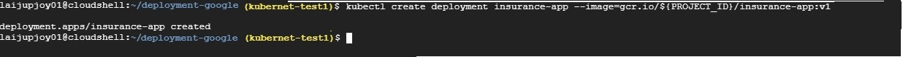

## Step 10 - Expose your application to the internet

By default, the containers you run on GKE are not accessible from the internet because they do not have external IP addresses. 
Execute the following code to expose the application to the internet:

kubectl expose deployment insurance-app --type=LoadBalancer --port 80 --target-port 8080

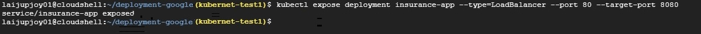

## Step 11 - Check Service

Execute the following code to get the status of the service. 
EXTERNAL-IP is the web address you can use in browser to view the published app.

kubectl get service

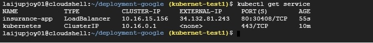

## Step 12 - See the app in action on http://EXTERNAL-IP:PORT

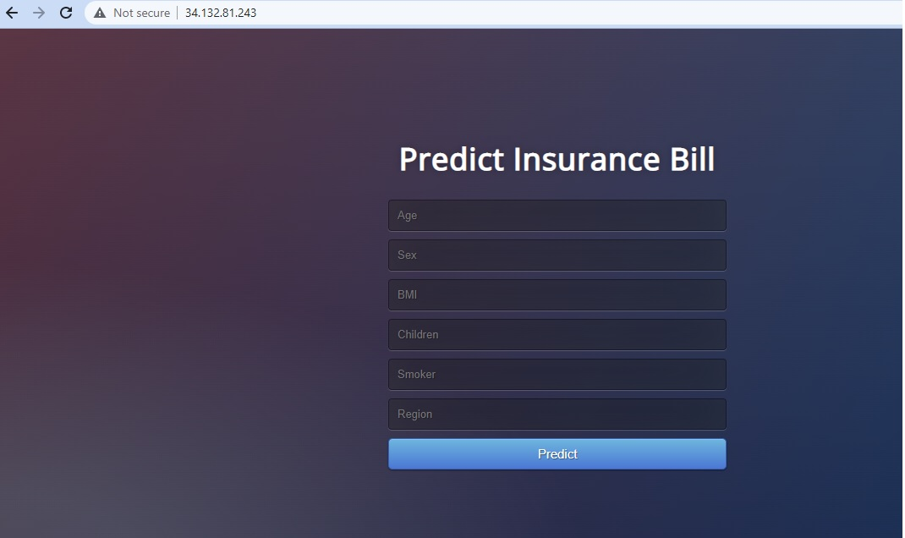

## Step 13 - Configuring autoscale deployment in kubernetes   

Autoscaling based on resources utilization: 

This will creates Horizontal Pod Autoscaler object to autoscale the Deployment when CPU utilization surpasses 50%, 
and ensures that there is always a minimum of 3 replica and a maximum of 6 replicas.

Execute the following command to autoscale the application:

kubectl autoscale deployment <Project_name> --max 6 --min 3 --cpu-percent 50

### Manual Scaling

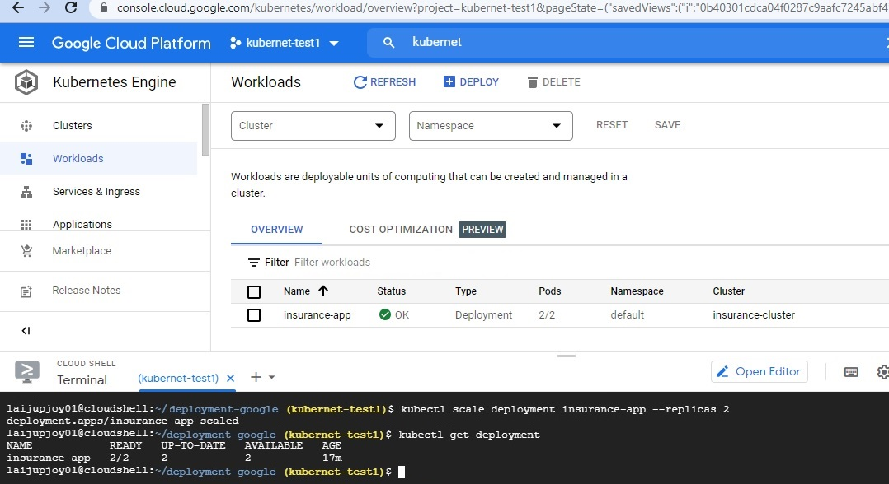

### Auto-Scaling

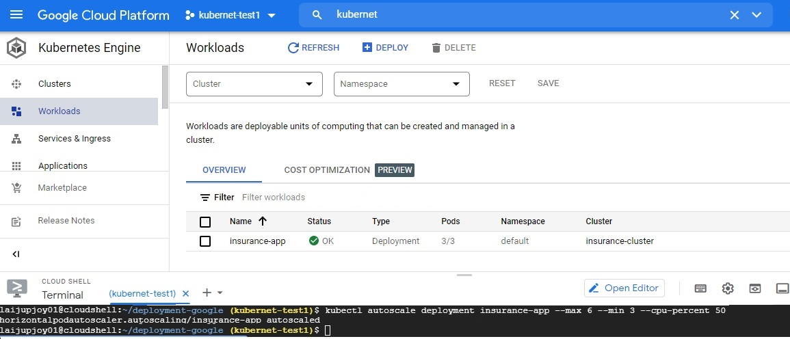
        

### Auto-Scaling Deployment_Details

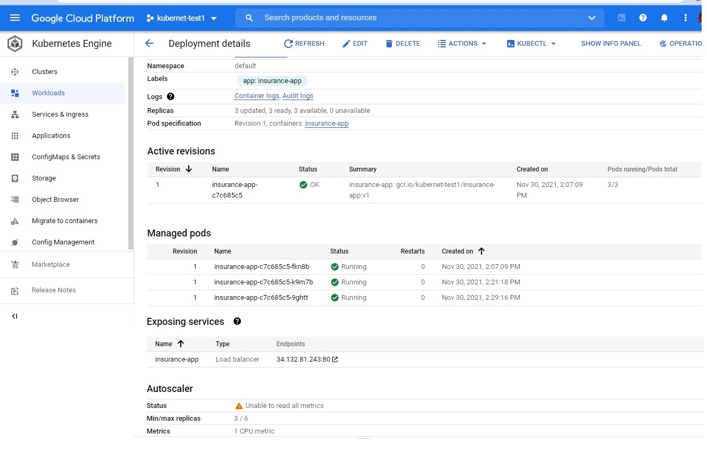

## Tech Stack

**Programming Language:** Python

**Libraries:** tensorflow,numpy,scikit-learn,pandas

**Cloud:** Google Cloud Platform

**Cloud Services:** Kubernetes,Docker,Container Registry,Kubernetes Engine,Cloud Shell

**IDE:** Pycharm 

**Credit:** https://towardsdatascience.com/deploy-machine-learning-model-on-google-kubernetes-engine-94daac85108b

